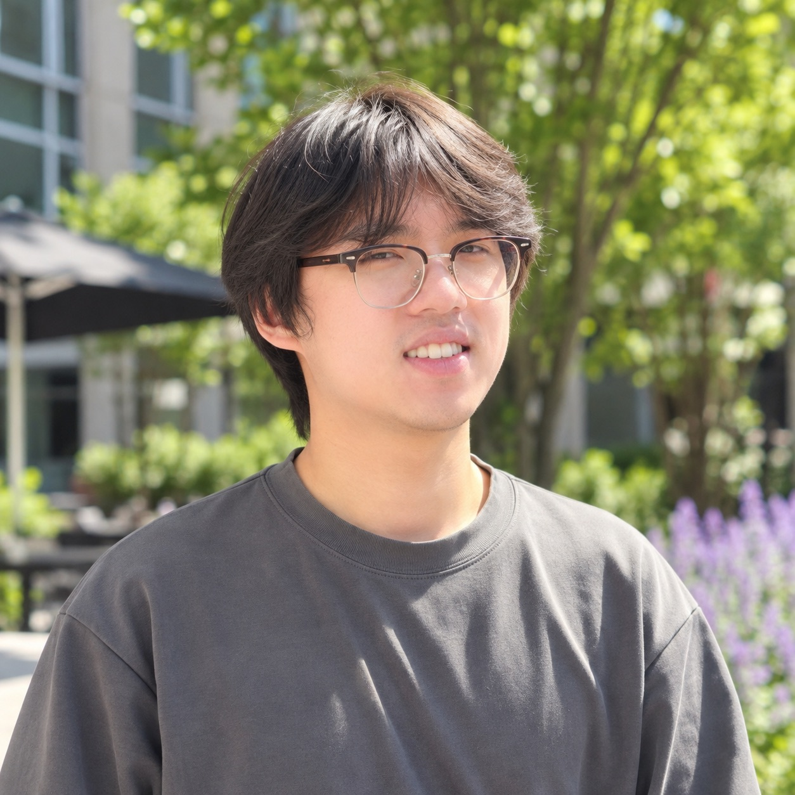
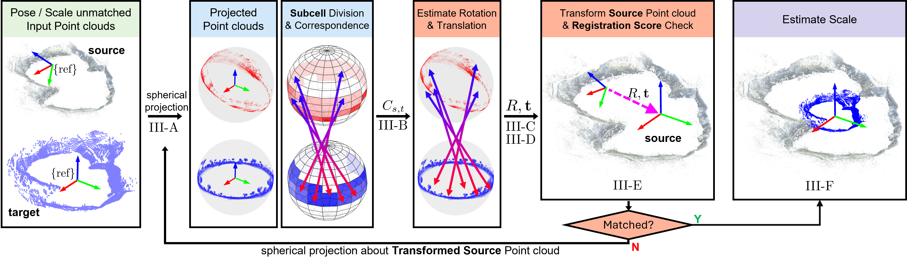
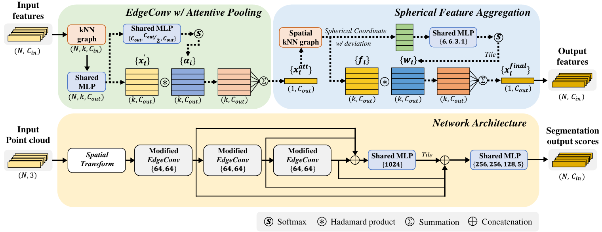

## About Me

I am a Ph.D. student in Mechanical Engineering at Purdue University.

My research focuses on developing generalizable robotic perception, learning, and manipulation methods for complex and underexplored environments. In particular, I am interested in using challenging environments, including precision manufacturing, as testbeds for advancing generalizable robotics rather than developing task-specific automation systems.

Previously, I was with [INRoL](https://www.inrol.snu.ac.kr/), where my research focused on generalizable navigation and scene understanding for mobile robots.
I am currently with [LAMM](https://purduelamm.github.io/home/), where I use complex manufacturing environments as a testbed for developing generalizable robotic perception, learning, and manipulation methods, particularly by tackling challenging edge cases that are often underexplored in conventional robotics settings.

## Research Interests

Robot Perception · 3D Scene Reconstruction · Robot Learning · Dexterous Manipulation

## Publications

### *Journal Articles*

Toward Provably Safe AI-Driven Perception and Motion Planning for Robotic Manufacturing: A Review.  
*Journal of Manufacturing Systems*, 2026.  
H. Lee, Y. Sim, J. Jang, **B. Yoon**, *et al.*  

[Paper](https://www.sciencedirect.com/science/article/pii/S0278612526001974)

---

Fast and Robust Online Initialization of Monocular Visual-Inertial Odometry via One-Dimensional Cost Approximation.  
*IEEE Transactions on Robotics*, 2026.  
J. Kang, J. Choe, D. Kong, **B. Yoon**, *et al.*  

[Paper](https://ieeexplore.ieee.org/abstract/document/11488893)

---

Directional Correspondence Based Cross-Source Point Cloud Registration for USV-UAV Cooperation in Lentic Environments.  
*IEEE Robotics and Automation Letters*, 2025.  
**B. Yoon**, S. Hong, D. Lee.  

[Paper](https://ieeexplore.ieee.org/document/10816390) / [YouTube](https://www.youtube.com/watch?v=MwMY65CztuY)

    

---

Machine Learning-Aided Three-Dimensional Morphological Quantification of Angiogenic Vasculature in the Multiculture Microfluidic Platform.  
*BioChip Journal*, 17, 357–368, 2023.  
W. Lee, **B. Yoon (Co-first)**, *et al.*  

[Paper](https://link.springer.com/article/10.1007/s13206-023-00114-2) / [Github](https://github.com/won5830/Machine-learning-assisted-3D-angiogenesis-quantification)

    

---

### *Conference Papers*

LiDAR-Integrated Coarse-to-Fine Optimization for Geometrically Consistent Triangle Splatting from Mobile Robots.  
*IEEE/RSJ International Conference on Intelligent Robots and Systems (IROS)*, 2026 (Accepted).  
**B. Yoon**, *et al.*  

*Paper and code coming soon.*

  <video autoplay loop muted playsinline>
    <source src="imgs/Tri_opti.webm" type="video/webm">
  </video>

  <video autoplay loop muted playsinline>
    <source src="imgs/Tri_demo.webm" type="video/webm">
  </video>

---

UWB-Based Localization System Considering Antenna Anisotropy and NLOS/Multipath Conditions.  
*IEEE/RSJ International Conference on Intelligent Robots and Systems (IROS)*, 2024.  
T. Kim, **B. Yoon**, D. Lee.  

[Paper](https://ieeexplore.ieee.org/document/10802170/) / [GitHub](https://github.com/INRoL/inrol_uwb_localization)

---

T. Kim, **B. Yoon**, D. Lee.  
UWB-Based Localization System Considering Antenna Anisotropy and NLOS Conditions.  
*Institute of Control, Robotics and Systems (ICROS)*, 2024.
